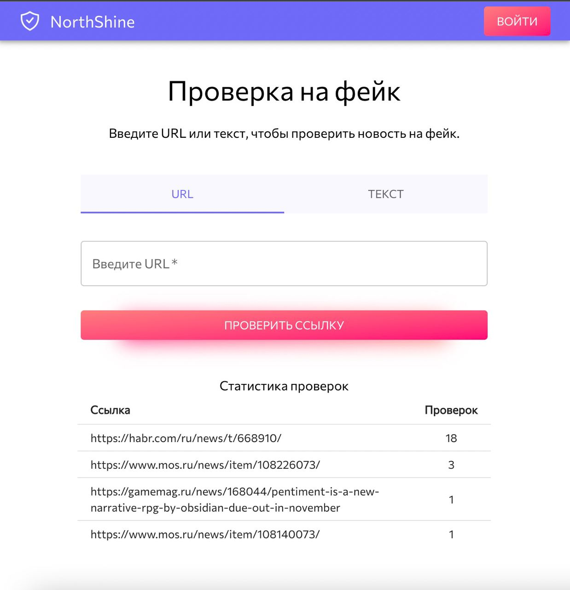
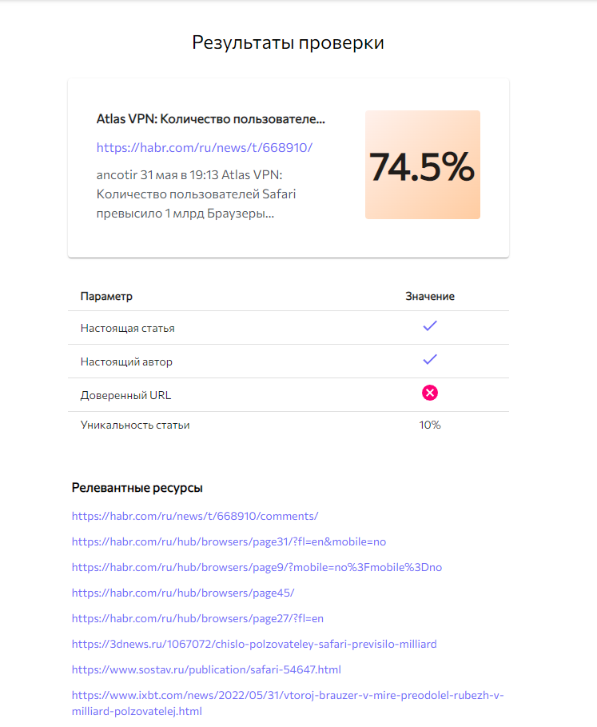
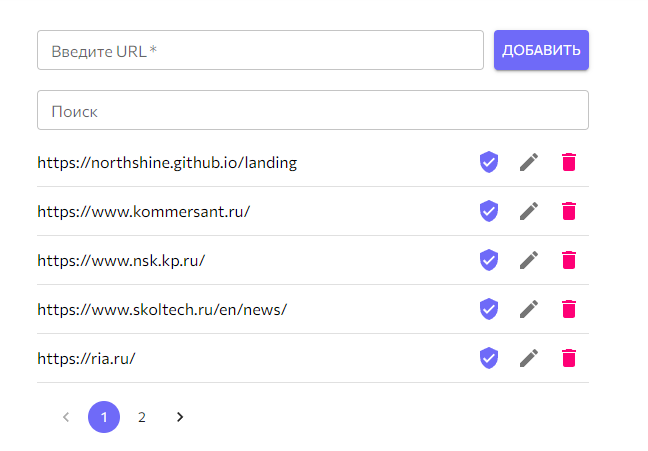

# moscowcityhack-backend-api
### Fake news determining for MoscowCityHack by the NorthShine team.
#### Based on neural network for text processing and parsing open news sources.
#### We use SearX (https://searx.github.io/searx/) for searching and parsing information.

### Run project

1. make
2. python init_db.py
3. Setup searx (https://searx.github.io/searx/admin/installation-searx.html)
4. python src/main.py

### Short info about Rest API

There are four blueprints - admin, parser, trust_badge and statistics. 
Admin contains protected endpoints for whitelist. 
Parser contains endpoints for url and text parsers - they are send data to searx and returns parsed data (found information about author, title, article, etc).
Trust badge contains endpoints for setting and getting trust badges.
Statistics contains endpoint for getting stats per url.

### Infrastructure 

### User Interface

User can insert an url to the news, or the text. Our backend application will parse SearX results by one of these parameters. Below these fields are statistics for each site.

### Result example

There is the result example - you can see truth percentage (74.5%), fetched attributes and found relevant articles (among them must be the original news site). 

### Admin panel

A simple admin panel with which you can manage whitelist and give trust badges for trusted sites.

### Stack

- FastAPI
- SQLite
- SQLAlchemy
- Pytorch
- Sklearn
- nltk
