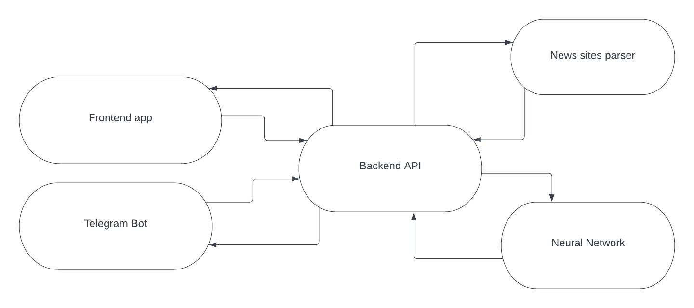

# moscowcityhack-backend-api
### Fake news determining for MoscowCityHack by the NorthShine team.
####Based on neural network for text processing and parsing open news sources.
####We use SearX (https://searx.github.io/searx/) for searching and parsing information.

### Run project

1. python3 -m venv venv
2. source venv/bin/activate
3. pip install -r requirements.txt
4. pip install -r src/text_analysis/requirements.txt
5. python -m dostoevsky download fasttext-social-network-model
6. Create config.yml. Use config.example.yml as an example
7. python init_db.py
8. Setup searx (https://searx.github.io/searx/admin/installation-searx.html)
9. python src/main.py

### Short info about Rest API

There are four blueprints - admin, parser, trust_badge and statistics. 
Admin contains protected endpoints for whitelist. 
Parser contains endpoints for url and text parsers - they are send data to searx and returns parsed data (found information about author, title, article, etc).
Trust badge contains endpoints for setting and getting trust badges.
Statistics contains endpoint for getting stats per url.

### Infrastructure 

### Stack

- FastAPI
- SQLite
- SQLAlchemy
- Pytorch
- Sklearn
- nltk
